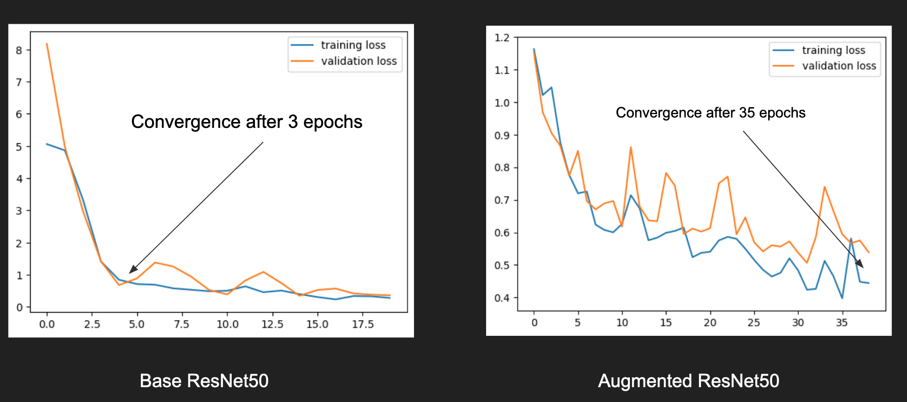
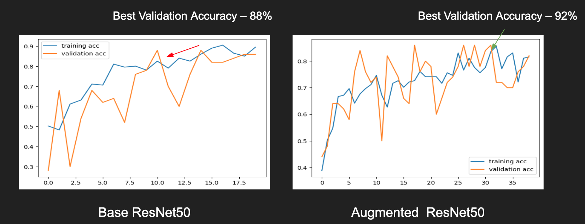
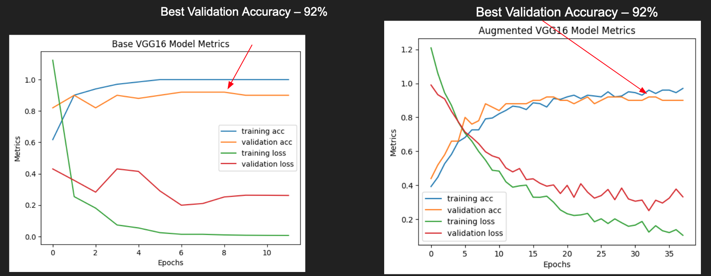
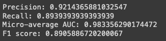
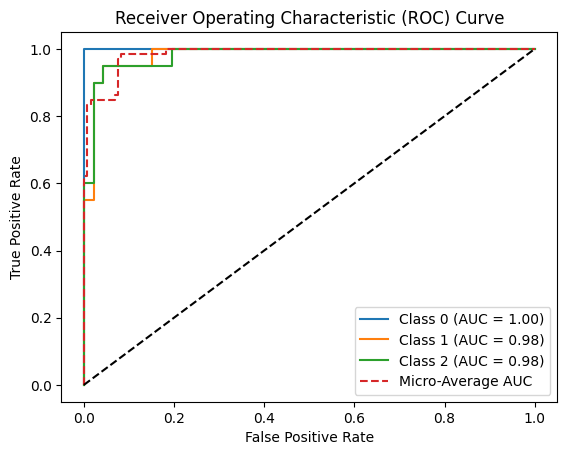
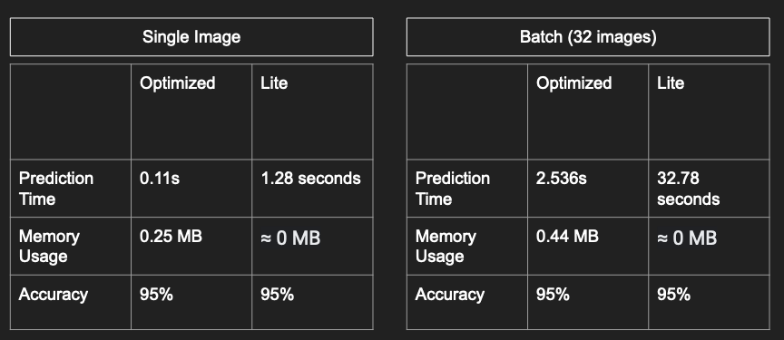

# Covid-19 Detection with Tuned CNN and TensorFlow Lite

## Project Description

Predicting the presence of COVID-19 from CAT Scans. Completed as a part of NYU's Advanced Machine Learning Course.

This repository is dedicated to the development and implementation of a sophisticated Covid-19 detection system using a Optimized Convolutional Neural Network (CNN) model. A version for edge devices have been created with the use of the TensorFlow Lite model.

The primary focus of this project is to create a portable, efficient, and highly accurate model that can identify the presence of Covid-19 through image analysis, specifically lung CAT scans. This project leverages the ResNet50 and VGG16 frameworks, augmenting them with deeper layers trained specifically on an applicable dataset. Additional hyperparameter tuning optimizes the model to performance with an accuracy score of near 95%.

With the help of the TensorFlow Lite library, we then convert this model into a compact, lightweight format, suitable for use on mobile and edge devices. This facilitates real-time analysis and prediction, paving the way for rapid detection and potentially life-saving interventions on mobile devices and low powered computers as an aid for health professionals.

**Features**

* Utilization of Convolutional Neural Networks (CNNs) to maximize efficiency and accuracy.
* Deployment on edge devices using TensorFlow Lite for real-time prediction.
* Comprehensive training and testing datasets for robust model validation.
* Easy-to-follow codebase, thoroughly documented for both beginners and advanced users.
* Detailed performance metrics and visualization tools to understand the model's effectiveness.
* Please note that while our aim is to provide a powerful tool to aid in the detection of Covid-19, it is not intended to replace professional medical advice or diagnosis. Always consult a healthcare professional for medical concerns.

## Repository Structure and Code

This repository is structured in the following manner

* `assets`: assets for this README
* `models`: weights for various models
* `analysis.ipynb`: the main notebook/code file for this project. This files contains step by step directions on how to run the program and is well documented.

Note that the code for this repository is primarily held within `nalysis.ipynb.` For details on how to run the program, please consult the below section. Our notebook contains the following sections.

* Adv ML Final Project
  * Goals
  * Code
  * Pre-processing and Data Cleaning
  * Base Models and Augmentation
    * ResNet50 Base Model
      * Comparison
    * VGG16 Model Augmentation
      * Comparison
  * Hyperparameter Tuning
    * VGG16 Tuning
    * ResNet50 Tuning
  * Tensorflow Lite Conversion
    * Save the Optimized Model
  * Performance Evaluation
  * Conversion
    * Batched Image Performance
    * Single Image Performance

## Executing the Program

To run the COVID-19 detection Program in Google Colab, follow the steps outlined below:

1. Open the analysis.ipynb file in Google Colab.
2. Download the data for the project and upload it either to your runtime or to your Google Drive. You can find the Dataset at this [Kaggle Competition](https://www.kaggle.com/datasets/pranavraikokte/covid19-image-dataset).
3. Set the path variable to the location of where your data is stored within Google Drive/the session. This can be done by modifying the `path` variable in the notebook. Replace `'path/to/data'` with the actual path to the dataset on your Google Drive.

    ```python
    path = 'path/to/data'
    ```

4. Mount your Google Drive by executing the code cell that prompts you to authenticate and authorize access to your drive. This is required to be able to access the data stored in your runtime.

5. Run the remaining code cells in the notebook sequentially. Note that you should be connecting a GPU runtime for the best performance. The notebook is well documented with a concise table of contents specify exactly what section or where a specific portion of the code will be run. Please feel free to raise an issue if you are having trouble!

## Results

Here is a brief summary of our results. 

### ResNet50 Comparison

We note that we began by training the ResNet50 Base and Augmented Models. We compare their loss and performance below. 





We note that for this model, while the augmented model had better accuracy on validation set and better overall accuracy on train set, it was much more volatile performance and did not converge as well, as evidenced by our loss graph. In fact, it took up to 35 epochs to converge to the same level as our base model. In addition, hyperparameter tuning did not increase the base performance significantly.

### VGG16 Comparison

We now compare the results of our training on the VGG16 Model. Note that in the image below we plot loss and validation accuracy on the same sets of graphs.



We note that for the Augmented VGG16 Model we perform better on both the validation set as well as overall accuracy. In addition, after hyperparameter tuning, our model performs at 95% accuracy, which is the best performance that we have seen so far. However, this increased performance comes at a cost - it takes longer to converge (and is much more volatile in this regard) and is more computationally expensive. 

### Best Model Comparison

We note that our best model so far is the augmented VGG16 Model. As such, we dive a bit deeper into the model to explore its performance across a wider set of metrics.

First, we plot explore the precision, AUC, F1 and accuracy for the model. These results are shown below. 



We also graph the ROC Curve for this model as well. 



* Our results indicate that our precision is quite high for this model, which is what we want to see for a model that deals with medical data. While we are primarily concerned with optimizing recall, to prevent false negatives from slipping through the cracks, minimizing the number of false positives also helps us to prevent the use of mismanaged resources.
* We note that with a recall score of 0.89, we minimize the number of false positives that the model missing. This is especially important for healthcare fields.
* With an AUC score of 0.98, we note that the model has excelled discrimnatory power between COVID-19 and non-COVID-19 cases based on the probability predictions. 
* In this case, the F1 score of 0.85 suggests that the model achieves a good balance between precision and recall, taking into account both false positives and false negatives.
* With an accuracy of 0.95, our model correctly predicts the COVID-19 and non-COVID-19 cases from the lung CAT scans 95% of the time.

### Optimized Vs. Lite Model

Finally, we converted our optimized (best) model to a Tensorflow Lite model, which should be able to be run on edge devices. We note these results below. 



* We note that there are two comparisons being done here - one with a batch of 32 images as well as just a single image. This is because our optimized model can accept batches of images as a single input while the lite model can only accept a single image. As such, we have compared the performance of both batched input as well as single image input. 
* We note that the resulting accuracy is the same across both models. 
* We note that while the optimized modded took much more time, the Lite mode used much less resources, which is what we expect to see. For running on edge devices that have few resources available, resource constraints are key for us to consider. As such, for both instances, the memory used by the Lite model is nearly zero, to the extent that we could not measure the memory usage. This bodes a good result but may also be due to the way that we are measuring the model performance. 

## Contributions

This is an open-source project. We welcome contributions, ideas, and suggestions to improve the model's effectiveness and usability. Please follow these simple rules for making contributions effectively.

* **For the Repository** - please create your own version of the Repository and make your changes on your own version.
* **Commit and Push** - once you have made the necessary changes, please push to `master` and submit a PR.
* **Submit a PR**: Please open a PR to merge into the original repository.
  * You will need the approval of a maintainer to be able to push to `master`

Thank you for considering contributing to this project. Your efforts can make a significant difference in advancing COVID-19 detection capabilities. Let's work together to create a better, more robust solution!

Stay Safe, Stay Healthy.
